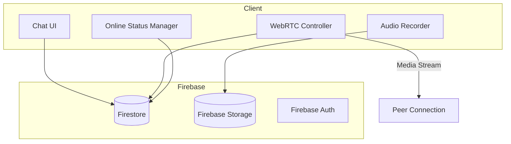
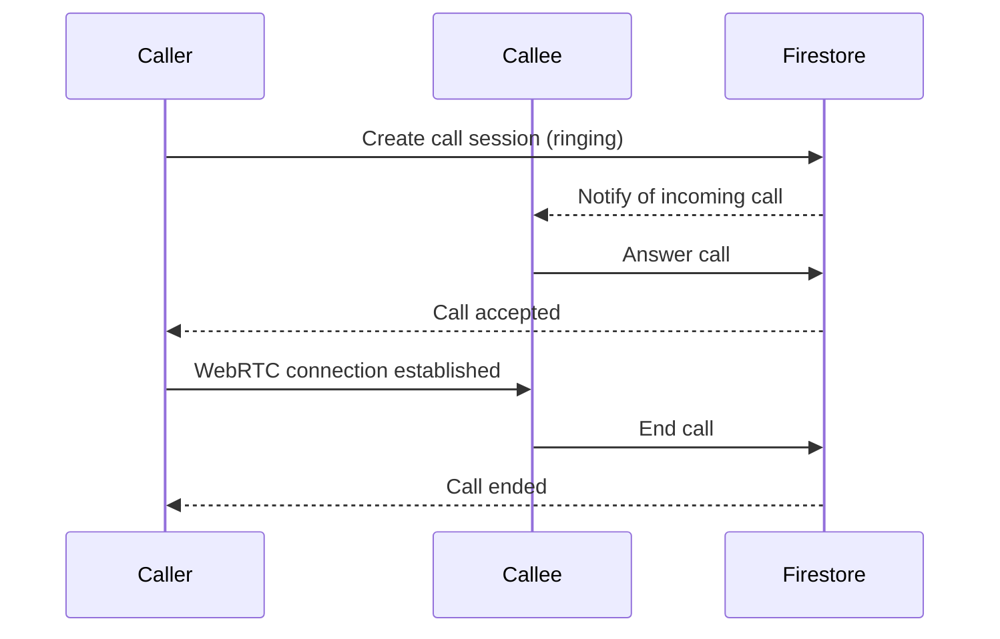

# WhatsApp-Style Chat & Calling Implementation Plan

## Executive Summary

This document outlines a comprehensive plan to transform the existing basic text chat into a full-featured WhatsApp-style communication system with voice/video calling, online status, read receipts, typing indicators, and voice messages.

---

## 1. Current System Analysis

### Existing Components
- **ChatWindow.tsx** - Basic text messaging UI
- **chatService.ts** - Firestore-based message storage and retrieval
- Uses Firebase Realtime Database concepts via Firestore snapshots

### Current Limitations
- Text-only messages
- No voice/video calling capability
- No online status tracking
- No read receipts
- No typing indicators
- No voice message support

---

## 2. Architecture Overview

### Technology Stack
| Feature | Technology | Purpose |
|---------|------------|---------|
| Real-time Communication | WebRTC (simple-peer) | Voice/Video calls |
| Signaling Server | Firebase Firestore | Call setup & negotiation |
| Online Status | Firestore presence system | User online/offline tracking |
| Voice Messages | Web Audio API + Firebase Storage | Record & store audio |
| Real-time Updates | Firestore onSnapshot | Typing indicators, read receipts |

### System Architecture Diagram


---

## 3. Feature Implementation Plan

### 3.1 Voice & Video Calls

#### Architecture
- Use **simple-peer** library for WebRTC abstraction
- Firebase Firestore for signaling (offer/answer/ICE candidates)
- Support 1-on-1 calls initially, expandable to group calls

#### Data Structures
```typescript
interface CallSession {
  id: string;
  callerId: string;
  calleeId: string;
  type: 'voice' | 'video';
  status: 'ringing' | 'active' | 'ended' | 'declined';
  startedAt: any;
  endedAt?: any;
}

interface SignalingMessage {
  type: 'offer' | 'answer' | 'ice-candidate' | 'call-request' | 'call-response';
  callId: string;
  senderId: string;
  receiverId: string;
  data?: any;
  timestamp: any;
}
```

#### Implementation Steps
1. Install simple-peer: `npm install simple-peer`
2. Create CallService with signaling logic
3. Add call buttons to ChatWindow UI
4. Implement call ring/answer/decline workflow
5. Handle call state transitions

#### Call Flow


---

### 3.2 Online Status Tracking

#### Implementation
- Use Firestore document in `users/{userId}` with `presence` subcollection
- Implement heartbeat system (update every 30 seconds)
- Use Firestore `onSnapshot` for real-time status updates

#### Data Structure
```typescript
interface UserPresence {
  userId: string;
  isOnline: boolean;
  lastSeen: any;
  lastActive: any;
}
```

#### Implementation Steps
1. Add presence fields to user profile
2. Create PresenceService
3. Implement online/offline detection
4. Update UI to show green/gray status dots

---

### 3.3 Read Receipts

#### Implementation
- Track message delivery and read status
- Update status when recipient opens conversation

#### Data Structure
```typescript
interface MessageStatus {
  messageId: string;
  senderId: string;
  deliveredAt?: any;
  readAt?: any;
}
```

#### Implementation Steps
1. Add `status` field to Message type
2. Update status on message delivery (onSnapshot)
3. Mark messages as read when conversation is opened
4. Display checkmarks (✓, ✓✓) like WhatsApp

---

### 3.4 Typing Indicators

#### Implementation
- Use Firestore document with short TTL
- Emit typing event on text input
- Listen for typing events in conversation

#### Implementation Steps
1. Create typing indicator document
2. Add input change handler in ChatWindow
3. Display "typing..." animation
4. Auto-clear after 3 seconds of inactivity

---

### 3.5 Voice Messages

#### Implementation
- Use MediaRecorder API for recording
- Store audio in Firebase Storage
- Send message with audio URL

#### Data Structure
```typescript
interface VoiceMessage {
  id: string;
  senderId: string;
  audioUrl: string;
  duration: number; // seconds
  waveform?: number[]; // visual representation
  createdAt: any;
}
```

#### Implementation Steps
1. Add microphone button to ChatWindow
2. Implement audio recording UI
3. Upload to Firebase Storage
4. Create audio player component
5. Display voice message bubbles with waveform

---

## 4. UI Modifications

### ChatWindow Updates
- Add call button (phone icon) next to send button
- Add video call button
- Add microphone button for voice messages
- Add typing indicator area
- Add read receipt indicators
- Add online status dot in header

### Visual Elements
```
┌─────────────────────────────────────┐
│  [●] John Doe           📞 🎥    │  ← Online status + Call buttons
├─────────────────────────────────────┤
│  ┌─────────────────────────────┐   │
│  │ Hello! How are you?        │   │  ← Sent message
│  │ ✓✓ 10:30 AM               │   │  ← Read receipt
│  └─────────────────────────────┘   │
│  ┌─────────────────────────────┐   │
│  │ I'm good! Thanks!          │   │  ← Received message
│  │ ✓ 10:31 AM                │   │  ← Delivered
│  └─────────────────────────────┘   │
│       ● John is typing...          │  ← Typing indicator
├─────────────────────────────────────┤
│  [🎤] [     Type a message    ] [📤] │
└─────────────────────────────────────┘
```

---

## 5. Implementation Phases

### Phase 1: Foundation (Week 1)
- [ ] Install dependencies (simple-peer)
- [ ] Create CallService
- [ ] Implement presence/online status
- [ ] Basic call UI buttons

### Phase 2: Voice & Video (Week 2)
- [ ] Implement 1-on-1 voice calls
- [ ] Implement 1-on-1 video calls
- [ ] Add call controls (mute, video toggle, end)
- [ ] Handle call notifications

### Phase 3: Enhanced Messaging (Week 3)
- [ ] Implement typing indicators
- [ ] Implement read receipts
- [ ] Add voice message recording
- [ ] Add audio playback

### Phase 4: Polish (Week 4)
- [ ] Group calls (if time permits)
- [ ] Call history
- [ ] Push notifications for calls
- [ ] Performance optimization

---

## 6. Dependencies

```json
{
  "dependencies": {
    "simple-peer": "^9.11.1",
    "firebase": "^10.x.x",
    "audio-recorder-polyfill": "^0.4.0"
  }
}
```

---

## 7. File Structure Changes

### New Files
```
src/
├── services/
│   ├── callService.ts        # WebRTC call handling
│   ├── presenceService.ts     # Online status
│   └── voiceMessageService.ts # Voice recording
├── components/
│   ├── Common/
│   │   ├── CallWindow.tsx    # In-call UI
│   │   ├── VoiceRecorder.tsx # Voice message UI
│   │   └── AudioPlayer.tsx   # Voice message playback
│   └── Calling/
│       ├── IncomingCallModal.tsx
│       ├── ActiveCallScreen.tsx
│       └── CallControls.tsx
├── hooks/
│   ├── usePresence.ts
│   ├── useCall.ts
│   └── useVoiceRecorder.ts
└── types/
    └── index.ts              # Add call types
```

### Modified Files
```
src/
├── components/Common/ChatWindow.tsx  # Add call buttons, typing
├── services/chatService.ts            # Add typing, receipts
└── firebase.ts                       # Add Storage bucket
```

---

## 8. Security Considerations

1. **Call Authentication**: Only authenticated users can initiate/receive calls
2. **Call Authorization**: Users can only call staff, staff can call students
3. **Voice Message Storage**: Use Firebase Storage security rules
4. **Presence Data**: Only show presence to relevant users (student's staff)

---

## 9. Testing Plan

1. **Unit Tests**: Test individual services
2. **Integration Tests**: Test call flow end-to-end
3. **UI Tests**: Test typing indicators, read receipts
4. **Performance Tests**: Test with multiple concurrent calls

---

## 10. Summary

This plan provides a comprehensive roadmap to implement WhatsApp-style communication features. The implementation is modular, starting with foundational features and progressively adding more complex capabilities.

**Key Benefits:**
- Keep existing UI (as requested)
- Add powerful calling features
- Real-time messaging enhancements
- Professional communication experience
